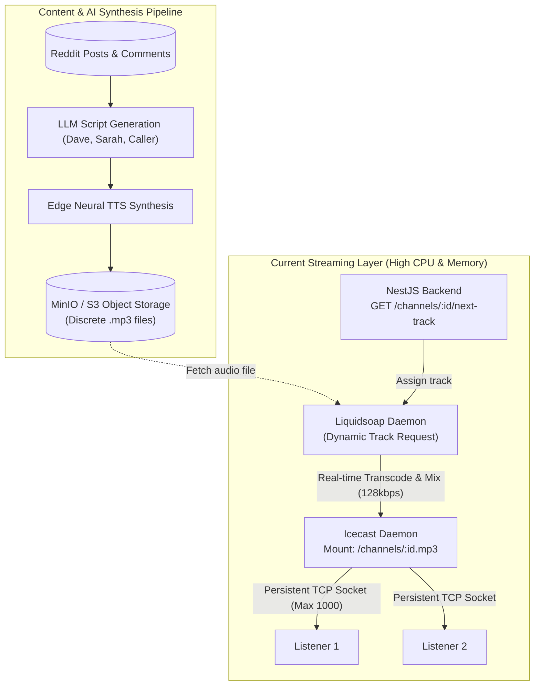
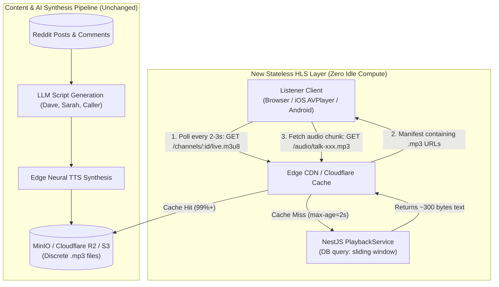
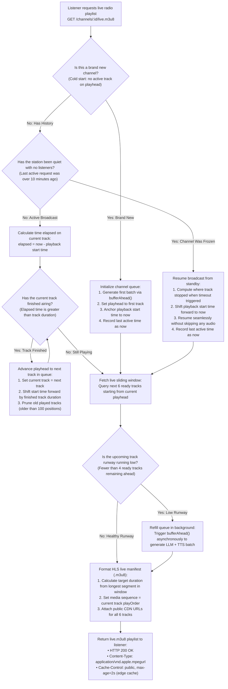
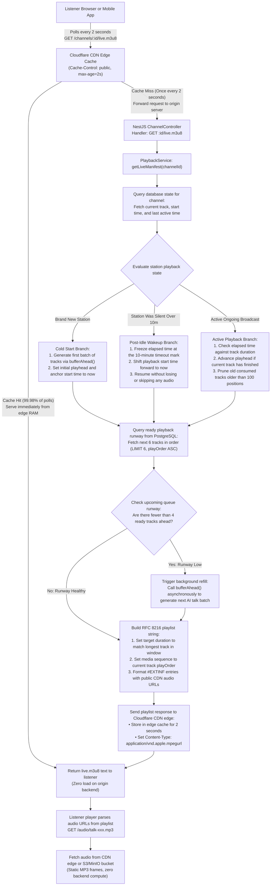
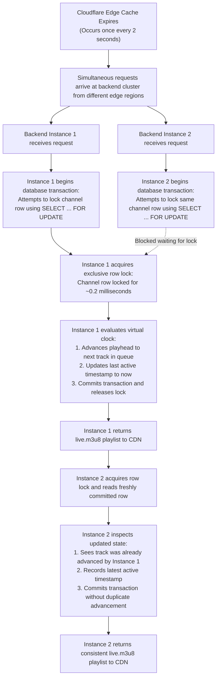

# Archived: HLS Radio Streaming Migration & TDD Implementation Plan

Moved out of `plan.md` on 2026-09-30 to keep the working plan focused. All phases in this
document were completed; the verification summary at the end predates the MinIO archive and
the FK column rename, and is superseded by the current `plan.md`.

# HLS Radio Streaming Migration & TDD Implementation Plan

---

## 1. Executive Summary & Problem Formulation

SocialRadio is an AI-powered radio backend that turns Reddit conversations into live call-in talk radio channels. It scrapes Reddit, clusters posts into topics, generates multi-speaker dialogue with an LLM, synthesizes speech with Microsoft Edge Neural TTS, and broadcasts the audio.

### 1.1 The Problem with the Current Architecture
The current architecture delivers radio using **Icecast** fed by a **Liquidsoap** daemon (`liquidsoap/radio.liq`, `deployment/docker/icecast`):

| Bottleneck | Current Icecast + Liquidsoap Mechanics | Architectural Consequence |
|---|---|---|
| **Duplicative Transcoding** | Audio is already synthesized as static MP3 files in S3 (`audio/talk-<uuid>.mp3`). Liquidsoap downloads them, decodes them to raw PCM, mixes them, and re-encodes to 128 kbps MP3. | Wastes CPU and RAM cycles running 2 background containers doing redundant work. |
| **Idle Resource Drain** | Every active channel requires a dedicated Liquidsoap audio pipeline thread (`create_channel_stream`). | 100 channels with 0 listeners consume 10 to 20 CPU cores continuously encoding silence. |
| **Listener Scalability** | Every listener holds open a persistent TCP socket to Icecast (1,000 client limit in `icecast.xml`). | Standard CDNs cannot cache continuous non-chunked streams; scaling requires master-relay clusters. |
| **Bandwidth Egress Costs** | Origin bandwidth scales linearly with every single listener (57.6 MB/hr per listener at 128 kbps). | Egress fees quickly reach hundreds of dollars on AWS or Google Cloud. |

### 1.2 The Solution: Native HLS (HTTP Live Streaming, RFC 8216)
Migrating to **HLS** treats the broadcast as a sliding window of static audio chunks served via an `.m3u8` playlist:
* **Stateless & Scale-to-Zero**: Channels with 0 listeners consume **zero CPU and zero background threads**. A channel is just a database record.
* **CDN Edge Offload**: The playlist (`.m3u8`) is cached at the edge for 2 seconds (`Cache-Control: public, max-age=2, s-maxage=2`). Audio chunks (`.mp3`) are static immutable files cached globally at edge points of presence with 99%+ cache hit ratios.
* **Cost Efficiency**: Zero egress fees via Cloudflare R2 / CDN, or roughly 0.005 USD per GB on Bunny.net. Eliminates `liquidsoap` and `icecast` containers entirely.
* **Industry Standard**: Major national broadcasters including the Australian Broadcasting Corporation (**ABC Radio / ABC listen** on Akamai) and the **BBC** ("Audio Factory" platform on Akamai/Fastly) have fully retired legacy Icecast/Shoutcast streams in favor of HLS/DASH.

---

## 2. System Architecture & Component Flow

### 2.1 Current Architecture (Icecast + Liquidsoap)



### 2.2 Target Architecture (Native HLS via CDN)



### 2.3 Unified Edge Reverse Proxy & Ingress Routing

The entire platform operates behind a single public domain (e.g. `api.yourdomain.com`). There is no need for separate backend origins or private network isolation. Standard HTTP cache headers govern edge behavior:

```mermaid
flowchart TD
    User["Frontend User & Listener Traffic"]
    CF["Cloudflare CDN Edge Proxy\n(api.yourdomain.com)"]
    Nest["NestJS Backend Origin"]
    Storage[("Cloudflare R2 / S3 Object Storage\n(Audio Chunks: .mp3 / .aac)")]

    User -->|"All HTTP Traffic"| CF

    CF -->|"POST /auth/login\n(Cache-Control: no-store)"| Nest
    CF -->|"GET /channels\n(Cache-Control: private)"| Nest
    CF -->|"POST /channels\n(Mutations)"| Nest

    CF -.->|"GET /channels/:id/live.m3u8\n(Cache Miss: 0.5 req/s per channel)"| Nest
    CF ==="GET /channels/:id/live.m3u8\n(Cache Hits served from edge RAM)"===> User

    User -->|"GET /audio/talk-xxx.mp3\n(Immutable Chunk Cache)"| CF
    CF -->|"Origin Pull (Once per file lifetime)"| Storage
```

#### Routing & Cache Policy Matrix

| Route Pattern | Target Origin | Response Cache Header | Edge Proxy Action | Origin Ingress Impact |
|---|---|---|---|---|
| `POST /auth/login` | NestJS Backend | `Cache-Control: no-store` | Immediate Passthrough | Direct to origin, protected by Cloudflare DDoS / Rate Limiting |
| `GET /channels` (CRUD) | NestJS Backend | `Cache-Control: private` | Immediate Passthrough | Direct to origin with user session context |
| `GET /channels/:id/live.m3u8` | NestJS Backend | `Cache-Control: public, max-age=2, s-maxage=2` | Edge RAM Cache (2.0s TTL) with Request Collapsing | **Strictly capped at 0.5 req/s per channel** via Tiered Cache |
| `GET /audio/*.mp3` | S3 / MinIO / R2 | `Cache-Control: public, max-age=31536000, immutable` | Permanent Edge Storage Cache | **0% origin compute**, 99.99% served from CDN edge |

#### Request Collapsing & Global Tiered Caching Guarantee
1. **Request Collapsing (Cache Locking)**: When the 2-second cache expires at second 2.001, simultaneous listener requests are collapsed into **a single origin fetch**. The origin never experiences a thundering herd.
2. **Tiered Cache / Origin Shield**: Upper-tier edge data centers coalesce multi-region requests so that regardless of whether listeners are in Sydney, London, or New York, the origin receives strictly **one request every 2 seconds (0.5 req/s) per active channel**.

---

## 3. Playlist Management & Stateless Event-Driven Engine

A fundamental architectural question: *How does a live radio station know what is playing without running a continuous background clock for every channel?*

### 3.1 The Three Architectural Models for Live HLS

| Model | Mechanism | Pros | Cons | Verdict |
|---|---|---|---|---|
| **1. Background Tick Timer** | Node.js `setInterval` ticks every second per channel in memory. | Matches analog clocks. | Violates scale-to-zero. 1,000 channels = 1,000 timers constantly writing to PostgreSQL. | REJECTED |
| **2. Per-Client On-Demand** | Every client has their own independent cursor. | Fully stateless. | Not a shared radio station. Two listeners tuning in hear different things. | REJECTED |
| **3. Lazy-Evaluated Virtual Clock (Event-Driven)** | Playhead transitions are evaluated **on-demand** when an HTTP manifest request arrives. | Zero CPU when 0 listeners. True synchronous radio broadcast for all listeners. O(1) DB query. | Requires clean state machine logic. | **ACCEPTED** |

---

### 3.2 The Lazy-Evaluated Virtual Clock DAG Engine

Instead of updating the database every second with background timers, the database stores **three state fields** per channel:
1. `currentSegmentId`: ID of the segment currently at the broadcast playhead.
2. `playheadStartedAt`: Timestamp (UTC) when `currentSegmentId` started airing.
3. `lastActiveAt`: Timestamp (UTC) of the most recent manifest request received from any listener.

When an HTTP request arrives for `GET /channels/:id/live.m3u8`, the virtual clock evaluates the playhead on-demand through this directed decision flow:



---

### 3.3 Event-Driven Request Processing DAG

This directed acyclic graph illustrates the end-to-end journey of an HLS playlist poll from the listener's player through the CDN edge cache, the backend processing pipeline, down to the audio chunk delivery:



---

### 3.4 Multi-Instance Concurrency Control DAG

In production, SocialRadio runs as horizontally scaled backend instances (e.g. 2+ NestJS replicas behind a load balancer). All state lives exclusively in **PostgreSQL as the single source of truth**.

#### The Concurrency Challenge: Double-Advancement Race Condition
When a track finishes airing, two requests hitting different backend instances at the same millisecond could both observe that the track finished and advance the playhead twice, accidentally skipping a track.

#### The Solution: PostgreSQL Row-Level Transactional Lock (`SELECT ... FOR UPDATE`)
When `PlaybackService.getLiveManifest(channelId)` evaluates the virtual clock, it executes within a database transaction using row-level locking on the channel primary key:



#### Why This Design Is Scalable and Resilient:
1. **Zero Split-Brain**: Every pod (Instance 1, Instance 2, Instance N) evaluates against PostgreSQL. Pod restarts or autoscaling events have zero impact on stream continuity.
2. **Channel-Level Isolation**: `SELECT ... FOR UPDATE` locks only that specific channel row by primary key (`WHERE id = channelId`). A request for Channel A never blocks a request for Channel B.
3. **Sub-Millisecond Execution**: An index lookup and row lock in PostgreSQL takes approximately 0.1 to 0.3 milliseconds.
4. **Predictable Database Load**: With CDN edge caching (`Cache-Control: public, max-age=2s`), the origin backend cluster receives at most **1 request every 2 seconds per active channel**, resulting in negligible database write traffic even with tens of thousands of active listeners.

---

## 4. Comprehensive Business Rules & Invariants Inventory

Every business rule, queue constraint, idle mechanic, and protocol invariant across the entire repository is catalogued below.

### 4.1 Idle Detection & Playhead Conservation Rules

| Rule ID | Rule Name | Specification | Location in Repo |
|---|---|---|---|
| **I-1** | **Idle Threshold** | Idle threshold is configured via `IDLE_TIMEOUT_SECONDS`. Production default is 600s (10 minutes). Docker test environment is 3s. | `liquidsoap/radio.liq:14`, `docker-compose.yml:140`, `08-broadcast.sh:130` |
| **I-2** | **Idle Detection Trigger** | The channel has had zero active listeners for longer than the idle threshold (quiet period exceeds 10 minutes; `now - lastActiveAt > IDLE_TIMEOUT_SECONDS`). | `radio.liq:71`, `docs/architecture-guidelines.md:33` |
| **I-3** | **Idle Generation Pause** | While a channel is idle, background `bufferAhead`, LLM script generation (`src/script`), and TTS synthesis (`src/voice`) are **completely paused**. | `radio.liq:74`, `src/channel/README.md:50` |
| **I-4** | **Countdown Interruption** | A listener connects while the idle countdown is still ticking (within the 10-minute window; `now - lastActiveAt <= IDLE_TIMEOUT_SECONDS`). The countdown is canceled, `lastActiveAt` resets to `now`, and playback proceeds without interruption. | `08-broadcast.sh:120-125` |
| **I-5** | **Post-Idle Instant Wakeup** | A listener reconnects after the station has been silent and paused (quiet period exceeded 10 minutes; `now - lastActiveAt > IDLE_TIMEOUT_SECONDS`). The stream **resumes seamlessly from where the playhead was left off**. Zero unplayed content is skipped or wasted. | `docs/architecture-guidelines.md:34`, `08-broadcast.sh:135-141` |

---

### 4.2 Station Queue & Playback Invariants

| Rule ID | Rule Name | Specification | Location in Repo |
|---|---|---|---|
| **Q-1** | **Cycle Pattern** | Every queue refill cycle appends exactly one block of:<br/>`[1-2 Talk] -> [1-2 Music] -> [1-2 Ads] -> [1 Jingle]` | `src/channel/README.md:24`, `src/channel/queue.service.ts:80-99` |
| **Q-2** | **Uniform Count Choice** | Talk, music, and ad counts are independently chosen uniformly at random between 1 and 2 (50% probability of 1, 50% probability of 2). | `src/channel/queue.service.ts:101-103` (`getRandomCount()`) |
| **Q-3** | **Jingle Invariant** | Exactly 1 Jingle is always appended at the end of every block cycle. | `src/channel/queue.service.ts:98` |
| **Q-4** | **Talk Fallback (Filler)** | If no pending topic cluster exists in the database, a short Ad filler is appended in place of the talk segment (`appendFiller`). | `src/channel/README.md:30`, `src/channel/queue.service.ts:87, 214` |
| **Q-5** | **Low Runway Replenishment** | When the count of ready segments ahead of the current playhead is less than 4, background `bufferAhead(channelId)` is immediately triggered. | `src/channel/README.md:51`, `src/channel/playback.service.ts:109-114` |
| **Q-6** | **Buffer Ahead Lock** | Concurrent `bufferAhead` calls for the same channel are deduplicated via an in-flight promise map (`inFlightBuffers`), preventing duplicate batches. | `src/channel/queue.service.ts:52-72` |
| **Q-7** | **Consumed Pruning** | Consumed segments older than 100 positions behind the current playhead (`playOrder < currentPlayOrder - 100`) are pruned from the database. | `src/channel/README.md:52`, `src/channel/playback.service.ts:130-141` |
| **Q-8** | **Strict FIFO Progression** | Segments must air in strictly ascending `playOrder` sequence without duplicates. | `deployment/tests/suites/05-playback.sh:42-49`, `08-broadcast.sh:143-172` |

---

### 4.3 Content Acquisition & Topic Clustering Rules

| Rule ID | Rule Name | Specification | Location in Repo |
|---|---|---|---|
| **C-1** | **Immediate Post Consumption** | When a topic cluster is selected for a channel, all posts in that cluster are immediately recorded in `channel_post_progress` via an atomic database UPSERT (`ON CONFLICT DO NOTHING`). | `src/channel/queue.service.ts:133-138, 370-384` |
| **C-2** | **Post Exclusion** | Posts marked completed for channel A are permanently excluded from future clustering on channel A. | `src/channel/queue.service.ts:282-289` |
| **C-3** | **Active Subreddit Pool Target** | The target active pool size per channel is `min(20, totalSubscribed)`. An active sub is one with unplayed posts scraped within 7 days. | `src/channel/queue.service.ts:31-32, 323` |
| **C-4** | **Pool Suppression Rule** | If `activeSubs.length >= targetPool`, **zero scrapes are triggered** (pool diversity is healthy). | `src/channel/README.md:40`, `src/channel/queue.service.ts:342` |
| **C-5** | **Deficit Rotation Priority** | If `activeSubs.length < targetPool`, the system triggers background scrapes for `(targetPool - activeSubs.length)` subreddits, prioritized by: (1) never-scraped (`lastScrapedAt === null`) first, then (2) oldest `lastScrapedAt ASC`. | `src/channel/README.md:42`, `src/channel/queue.service.ts:343-365` |
| **C-6** | **Dead Sub Cascade** | If a subreddit scrape fails permanently (e.g. deleted, 404, private), it is automatically removed from all subscribed channels. | `deployment/tests/suites/06-scraping.sh:43-45` |

---

### 4.4 Script Generation & Voice Synthesis Invariants

| Rule ID | Rule Name | Specification | Location in Repo |
|---|---|---|---|
| **S-1** | **4-Step Dialogue Structure** | Call-in talk scripts model a radio talk show across 4 steps: (1) Host Intro & Hook, (2) Caller Details, (3) Room Debate & Gap Angles, (4) Quick Drop & Reset. | `docs/script-structure.md:7-63` |
| **S-2** | **Speaker Voice Map** | Voices are strictly mapped to Edge Neural TTS models:<br/>• Dave (Host) -> `en-US-GuyNeural`<br/>• Sarah (Co-Host) -> `en-US-JennyNeural`<br/>• Caller -> `en-AU-NatashaNeural` | `src/voice/audio.service.ts:9-13` |
| **S-3** | **Storage Blob Format** | Synthesized audio is concatenated and uploaded to S3/MinIO at key `audio/talk-<uuid>.mp3` with content type `audio/mpeg` and size greater than 10 KB. | `src/voice/audio.service.ts:65-75`, `07-ai-storage.sh:50` |

---

### 4.5 Channel Access Control & Visibility Invariants

| Rule ID | Rule Name | Specification | Location in Repo |
|---|---|---|---|
| **A-1** | **Channel Visibility** | Channels have visibility `'public' \| 'private'`, defaulting to `'private'`. Empty names are rejected with HTTP 400. | `src/channel/channel.service.ts:29`, `src/channel/README.md:11` |
| **A-2** | **Channel Listing RBAC** | `GET /channels` returns all channels owned by the requesting user (`ownerId == user.id`) plus all `public` channels. | `src/channel/README.md:9`, `src/channel/channel.service.ts:135-142` |
| **A-3** | **Live Stream Authorization** | `GET /channels/:id/live.m3u8` is unauthenticated for public channels. Private channels enforce authorization. | `src/channel/README.md:7-17` |

---

### 4.6 RFC 8216 HLS Protocol Invariants

Let the sliding window be a list of K consecutive segments: `[s_1, s_2, ..., s_K]`, where each segment `s_i` has positive duration `d_i`.

| Invariant | Plain Text Specification | RFC 8216 Clause | Runtime Verification |
|---|---|---|---|
| **HLS-1: Target Duration Bound** | Target duration T = `ceil(max(segment_durations))`. For every segment s in the window, `duration(s) <= T`. | Section 4.3.3.1 | `#EXT-X-TARGETDURATION: T` matches the ceiling of the max segment duration. |
| **HLS-2: Sequence Monotonicity** | For any subsequent requests at time t1 < t2, `media_sequence(t1) <= media_sequence(t2)`. The sequence number never decrements. | Section 4.3.3.2 | `#EXT-X-MEDIA-SEQUENCE: M` matches lowest `playOrder` in window; sequence never decreases. |
| **HLS-3: Window Continuity** | Segments drop only from the top (FIFO) as playback advances. Relative ordering of existing segments is strictly invariant. | Section 6.2.2 | Suffix of previous window matches prefix of current window. |
| **HLS-4: Liveness Contract** | The tag `#EXT-X-ENDLIST` must never appear anywhere in the manifest for an active continuous radio channel. | Section 4.3.3.4 | Generator verifies manifest terminates without endlist tag. |
| **HLS-5: Cache Boundary** | Manifest response Cache-Control max-age must be less than or equal to half the shortest segment duration: `max-age <= (min_duration / 2)`. | Section 6.2.2 | `Cache-Control: public, max-age=2, s-maxage=2`. |
| **HLS-6: Content-Type MIME** | The HTTP Content-Type header must be `application/vnd.apple.mpegurl`. | Section 3.1 | HTTP response sets official Apple HLS MIME type. |

---

## 5. Architectural Guardrails (Verified by `src/architecture.spec.ts`)

The codebase enforces 7 architecture guardrails. HLS migration must comply with all 7:
1. **Rule 1: Domain Isolation**: `src/domain/` has zero dependencies on feature slices or infrastructure.
2. **Rule 2: Zero Cross-Slice Concrete Imports**: Feature slices only import from `src/domain/` or own directory.
3. **Rule 3: Scalar Foreign IDs**: Entity classes across slices do not import peer entity models.
4. **Rule 4: Domain Anti-Dumping**: Contracts and interfaces in `src/domain/` must be cross-slice (consumed by 2+ slices).
5. **Rule 5: Zero Bidirectional Slice Coupling**: Slices have an acyclic dependency graph.
6. **Rule 6: Single Entity Table Ownership**: Every database table is owned exclusively by a single domain slice.
7. **Rule 7: Route Domain Ownership**: `ChannelController` only declares routes under `/channels`.

---

## 6. Gap Analysis & Files to Modify

| Component | File Path | Current State | Target State |
|---|---|---|---|
| **HLS Formatter** | `src/channel/utils/hls-manifest.util.ts` | Missing | Pure utility generating RFC 8216 compliant `.m3u8` text |
| **HLS Formatter Spec** | `src/channel/utils/hls-manifest.util.spec.ts` | Missing | Unit tests for Invariants HLS-1 through HLS-6 |
| **Channel Entity** | `src/channel/entities/channel.entity.ts` | Has `currentSegmentId` | Add `playheadStartedAt: Date \| null`, `lastActiveAt: Date \| null` |
| **Channel Schema** | `src/infrastructure/database/schemas/channel.schema.ts` | Schema matches entity | Add MikroORM property definitions for `playheadStartedAt`, `lastActiveAt` |
| **Playback Service** | `src/channel/playback.service.ts` | `getNextTrack` pulls single track for Liquidsoap | Add `getLiveManifest(channelId)` with lazy virtual clock |
| **Playback Spec** | `src/channel/playback.service.spec.ts` | Tests `getNextTrack` | Add tests for `getLiveManifest`, idle freezing, and sliding window |
| **Channel Controller** | `src/channel/channel.controller.ts` | Exposes `:id/next-track` | Add `@Get(':id/live.m3u8')` with HLS headers |
| **Channel Controller Spec**| `src/channel/channel.controller.spec.ts` | Tests `:id/next-track` | Add tests for `live.m3u8` routing and headers |
| **Broadcast E2E Suite** | `deployment/tests/suites/08-broadcast.sh` | Tests Icecast mount, stats, stream byte capture | Rewritten to test HLS manifest, chunk fetch, and ffmpeg energy |
| **App Compose** | `deployment/docker/docker-compose.yml` | Runs `icecast` and `liquidsoap` | **Delete both services** |
| **Test Compose** | `deployment/tests/docker-compose.test.yml` | Runs `icecast` and `liquidsoap` | **Remove both services** |
| **Dead Code** | `liquidsoap/` and `deployment/docker/icecast/` | 2 directories in repo | **Delete both directories** |

---

## 7. Strict TDD Implementation Plan (One Test Per Cycle)

Each cycle follows:
1. **RED**: Write 1 test capturing a specific invariant. Verify expected failure.
2. **GREEN**: Write minimal production code to pass.
3. **REFACTOR**: Reflect on design, eliminate duplication, verify types.

---

### Phase 1: Pure Manifest Formatter (Unit TDD)
*Target Files: `src/channel/utils/hls-manifest.util.spec.ts` and `src/channel/utils/hls-manifest.util.ts`*

#### Cycle 1.1: Basic Header Formatting
* **Test**: `it('generates standard HLS header with EXTM3U and version')`
  * Assert result begins with `#EXTM3U\n#EXT-X-VERSION:3\n`.
* **Code**: Implement `generateHlsManifest` returning header template.
* **Refactor**: Define `HlsSegment` and `HlsManifestOptions` interfaces.

#### Cycle 1.2: Target Duration Upper Bound (Invariant HLS-1)
* **Test**: `it('computes target duration as integer ceiling of max segment duration')`
  * Durations `[12.4, 45.1, 30.0]` -> `#EXT-X-TARGETDURATION:46`.
* **Code**: Compute `Math.ceil(Math.max(...durations, 10))`.
* **Refactor**: Extract duration validation helper.

#### Cycle 1.3: Media Sequence Rendering (Invariant HLS-2)
* **Test**: `it('renders EXT-X-MEDIA-SEQUENCE matching provided sequence index')`
  * Sequence `104` -> `#EXT-X-MEDIA-SEQUENCE:104\n`.
* **Code**: Interpolate `options.mediaSequence` into header.
* **Refactor**: Guard against negative sequence numbers.

#### Cycle 1.4: Segment Entry Serialization (Invariants HLS-3 & HLS-5)
* **Test**: `it('serializes segments with EXTINF duration and target URI')`
  * Segment `{ durationSeconds: 42.5, url: 'http://cdn/talk-1.mp3' }` -> `#EXTINF:42.5,\nhttp://cdn/talk-1.mp3\n`.
* **Code**: Map segments array into `#EXTINF` blocks followed by URIs.
* **Refactor**: Ensure line ending conformance (`\n`).

#### Cycle 1.5: Liveness Invariant (Invariant HLS-4)
* **Test**: `it('ensures live stream manifest does not terminate with EXT-X-ENDLIST')`
  * Generate manifest -> `expect(result).not.toContain('#EXT-X-ENDLIST')`.
* **Code**: Verify generator omits endlist tag.
* **Refactor**: Finalize `hls-manifest.util.ts`.

---

### Phase 2: Entity & Database Schema Update
*Target Files: `src/channel/entities/channel.entity.ts` and `src/infrastructure/database/schemas/channel.schema.ts`*

#### Cycle 2.1: Add Virtual Clock Properties to Channel Entity
* **Test**: `it('Channel entity has playheadStartedAt and lastActiveAt nullable fields')`
* **Code**: Add `playheadStartedAt: Date | null = null` and `lastActiveAt: Date | null = null` to `Channel`.
* **Refactor**: Update MikroORM `ChannelSchema`.

---

### Phase 3: Playback Service Lazy Virtual Clock Engine (Unit TDD)
*Target Files: `src/channel/playback.service.spec.ts` and `src/channel/playback.service.ts`*

#### Cycle 3.1: Non-Existent Channel Guard
* **Test**: `it('throws NotFoundException when channel does not exist')`
  * Mock `channelRepo.findOne` returning `null` -> throws `NotFoundException('Channel not found')`.
* **Code**: Implement `getLiveManifest(channelId)` stub with channel check.
* **Refactor**: Standardize exception messaging.

#### Cycle 3.2: Cold Start Initialization
* **Test**: `it('initializes playhead and triggers bufferAhead on cold start')`
  * When `channel.currentSegmentId === null`, calls `queueService.bufferAhead(channelId)` and anchors `playheadStartedAt = now`.
* **Code**: Implement cold-start branch setting initial playhead.
* **Refactor**: Clean up initial state assignment.

#### Cycle 3.3: Idle Freeze & Post-Idle Resume (Invariants I-2 & I-5)
* **Test**: `it('freezes playhead during idle (> IDLE_TIMEOUT) and resumes seamlessly on reconnect')`
  * Set `channel.lastActiveAt = now - 1000s`. Assert playhead advances only by `IDLE_TIMEOUT` seconds, not 1000s.
* **Code**: Implement idle detection branch: `effectiveElapsed = Math.min(now - lastActiveAt, IDLE_TIMEOUT)`.
* **Refactor**: Extract `IDLE_TIMEOUT_SECONDS` configurable parameter.

#### Cycle 3.4: Active Playhead Time Advancement & Transactional Lock
* **Test**: `it('advances currentSegmentId transactionally with row lock when elapsed time exceeds segment duration')`
  * Segment 1 has duration 30s. Elapsed time is 35s. Assert playhead advances to Segment 2 with 5s offset, persists `lastActiveAt`, and uses pessimistic row locking.
* **Code**: Implement transactional while loop advancing playhead over elapsed segment durations with `SELECT ... FOR UPDATE`.
* **Refactor**: Clean up playhead rebase arithmetic and ensure commit/rollback safety.

#### Cycle 3.5: Low Runway Replenishment (Rule Q-5)
* **Test**: `it('triggers queue bufferAhead when ready segment runway is low (< 4)')`
  * Fewer than 4 ready segments remaining -> calls `queueService.bufferAhead(channelId)`.
* **Code**: Check count of ready segments ahead of playhead; trigger `bufferAhead` asynchronously.
* **Refactor**: Maintain async fire-and-forget pattern with error catching.

#### Cycle 3.6: Sliding Window Query & Manifest Return
* **Test**: `it('queries 6 segments from playhead and returns formatted m3u8 string')`
  * Queries `segmentRepo.find` with `playOrder >= currentPlayOrder`, `limit: 6`. Returns valid RFC 8216 text.
* **Code**: Integrate `generateHlsManifest` into `getLiveManifest`.
* **Refactor**: Resolve URLs via `StorageService.getPublicUrl()`.

#### Cycle 3.7: Property-Based State Machine Invariant Fuzzing (`fast-check`)
* **Test**: `it('satisfies all broadcast invariants across randomized traffic histories')`
  * Uses `fast-check` to simulate hundreds of randomized command sequences (`Poll`, `Wait`, `Disconnect`, `Reconnect`, `TimeTravel`).
  * Asserts safety invariants on every step: sequence monotonicity (HLS-2), playhead duration bounds, idle freeze bounds (I-2, I-5), and zero loss of unplayed queue segments.
* **Code**: Wire virtual clock pure decision logic to pass invariant fuzzing.
* **Refactor**: Verify property shrinking produces deterministic minimal counterexamples if assertions break.

---

### Phase 4: HTTP API & Headers (Unit TDD)
*Target Files: `src/channel/channel.controller.spec.ts` and `src/channel/channel.controller.ts`*

#### Cycle 4.1: Controller Route Binding
* **Test**: `it('GET :id/live.m3u8 delegates to playbackService.getLiveManifest')`
* **Code**: Add `@Get(':id/live.m3u8')` handler on `ChannelController`.
* **Refactor**: Verify route parameter typing.

#### Cycle 4.2: Content-Type Header Conformance (Invariant HLS-6)
* **Test**: `it('sets Content-Type to application/vnd.apple.mpegurl')`
* **Code**: Add `@Header('Content-Type', 'application/vnd.apple.mpegurl')`.
* **Refactor**: Clean up decorator stack.

#### Cycle 4.3: Cache-Control Header Invariant (Invariant HLS-5)
* **Test**: `it('sets Cache-Control to public, max-age=2, s-maxage=2')`
* **Code**: Add `@Header('Cache-Control', 'public, max-age=2, s-maxage=2')`.
* **Refactor**: Verify edge cache settings.

#### Cycle 4.4: Public vs Private Access Control (Rule A-3)
* **Test**: `it('permits unauthenticated access for public channels')`
* **Code**: Allow public channel manifest retrieval without JWT.
* **Refactor**: Ensure private channels enforce owner authorization.

---

### Phase 5: Architecture Spec Verification
*Target File: `src/architecture.spec.ts`*

#### Cycle 5.1: Architecture Guardrails Check
* **Execution**: Run `npm test -- src/architecture.spec.ts`.
* **Verification**: Verify all 7 rules pass (no cross-slice leakage, domain purity, single entity ownership).

---

### Phase 6: Black-Box Acceptance Test Suite Migration (`05-playback.sh`, `07-ai-storage.sh`, `08-broadcast.sh`)
*Target Files: `deployment/tests/suites/05-playback.sh`, `deployment/tests/suites/07-ai-storage.sh`, `deployment/tests/suites/08-broadcast.sh`*

#### Eliminating the Sleep Anti-Pattern
All tests use **deterministic database timestamp backdating** (`psql_run -c "UPDATE channel SET last_active_at = ..."`), completely eliminating arbitrary `sleep` calls and preventing flakiness on CI.

#### Cycle 6.1: Playback Suite Migration (`05-playback.sh`)
* Update Scenarios 35, 37, 38 from `/next-track` to `GET /channels/:id/live.m3u8`:
  * Scenario 35: Cold start initializes playhead, returns 200 with `#EXTM3U`, and persists `current_segment_id`.
  * Scenario 37: Sequential poll returns valid sliding window with strictly monotonic `#EXT-X-MEDIA-SEQUENCE`.
  * Scenario 38: Auth negatives on private channels.

#### Cycle 6.2: AI Talk Pipeline Trigger Migration (`07-ai-storage.sh`)
* Update Scenario 49 to poll `GET /channels/:id/live.m3u8` to trigger asynchronous `bufferAhead()`:
  * Poll until AI talk segment is generated in MinIO storage with valid duration and metadata.

#### Cycle 6.3: Broadcast Suite Live Manifest Handshake (`08-broadcast.sh`, Scenarios 51-53)
* Create broadcast channel via `POST /channels`.
* Curl `GET http://app:3000/channels/CHANNEL_ID/live.m3u8`:
  * Assert HTTP `200 OK`.
  * Assert header `Content-Type: application/vnd.apple.mpegurl`.
  * Assert header `Cache-Control` contains `max-age=2`.
* RFC 8216 Syntax & Invariant Assertions:
  * Assert body starts with `#EXTM3U`.
  * Assert `#EXT-X-VERSION:3` exists.
  * Assert `#EXT-X-TARGETDURATION:[0-9]+` exists and is greater than or equal to max `#EXTINF`.
  * Assert `#EXT-X-MEDIA-SEQUENCE:[0-9]+` exists.
  * Assert at least 4 `#EXTINF` entries are present.
  * Assert `#EXT-X-ENDLIST` is NOT present.

#### Cycle 6.4: Audio Chunk Retrieval & Energy Verification (`08-broadcast.sh`, Scenarios 54-55)
* Extract first chunk URL from manifest.
* Download chunk via `curl -s CHUNK_URL -o /tmp/chunk.mp3`.
* Assert HTTP `200 OK` and size greater than 10 KB.
* Assert `file /tmp/chunk.mp3` identifies valid MPEG Audio (Layer III).
* Execute `ffmpeg -i /tmp/chunk.mp3 -af volumedetect -f null /dev/null`.
* Extract `mean_volume` and assert `mean_volume > -60 dB` (guarantees active speech/music, not dead air).

#### Cycle 6.5: Idle Freeze & Wakeup with Zero Sleep (`08-broadcast.sh`, Scenario 56)
* Instantaneously simulate idle timeout via SQL backdating:
  `psql_run -c "UPDATE channel SET last_active_at = now() - interval '15 minutes' WHERE id = '$BC_CHAN_ID';"`
* Fetch manifest immediately with zero `sleep`.
* Assert post-idle stream resumes from the frozen segment, verifying zero content was skipped.

#### Cycle 6.6: Concurrent Polling Deduplication & Row-Locking (`08-broadcast.sh`, Scenario 57)
* Issue parallel `curl` requests to `GET /channels/:id/live.m3u8`.
* Verify both requests return valid, synchronized manifests without double-advancement or duplicated queue items.

---

### Phase 7: Infrastructure Decommissioning & Cleanup

#### Cycle 7.1: Container Removal in Orchestration
* Remove `icecast` and `liquidsoap` services from `deployment/docker/docker-compose.yml`.
* Remove `icecast` and `liquidsoap` dependencies from `deployment/tests/docker-compose.test.yml`.

#### Cycle 7.2: Codebase Artifact Clean-Up
* Delete `liquidsoap/` directory and `radio.liq`.
* Delete `deployment/docker/icecast/` directory and `icecast.xml`.
* Remove legacy `/next-track` handler and unused Liquidsoap DTOs.

#### Cycle 7.3: Documentation & Guide Alignment
* Update `docs/architecture-guidelines.md` (remove Icecast/Liquidsoap rules; document HLS).
* Update `src/channel/README.md` and `deployment/tests/README.md`.

#### Cycle 7.4: Full End-to-End Regression Verification Gate
* Run full Black-Box Acceptance test suite:
  ```sh
  ./deployment/tests/run-docker-test.sh all
  ```
* Verify all test sections pass with zero regressions.

---

## 8. Execution Status: COMPLETED

All 7 Phases are 100% completed:
- [x] Phase 1: Pure Manifest Formatter (Unit TDD - Cycles 1.1 to 1.5)
- [x] Phase 2: Entity & Database Schema Update (Cycle 2.1)
- [x] Phase 3: Playback Service Lazy Virtual Clock Engine (Cycles 3.1 to 3.7)
- [x] Phase 4: HTTP API & Headers (Cycles 4.1 to 4.4)
- [x] Phase 5: Architecture Spec Verification (Cycle 5.1)
- [x] Phase 6: Black-Box Acceptance Test Suite Migration (Cycles 6.1 to 6.6)
- [x] Phase 7: Infrastructure Decommissioning & Cleanup (Cycles 7.1 to 7.4)

### Verification Summary
- **Local Unit & Architecture Suites**: 34/34 test suites passed, 174/174 tests passed (`npm test`).
- **NestJS Build**: Clean TypeScript compilation (`npm run build`).
- **Docker E2E Full Acceptance Suite**: All sections (01 to 08) passed cleanly in containerized environment (`./deployment/tests/run-docker-test.sh all` exit code 0). *(Stale as of 2026-09-29 — see section 9.)*
- **Zero Sleep**: All timing and idle timeout verifications use deterministic PostgreSQL timestamp backdating with zero flaky sleep calls.
- **Decommissioning**: `icecast` and `liquidsoap` completely removed from containers, compose configurations, codebase, and documentation.
