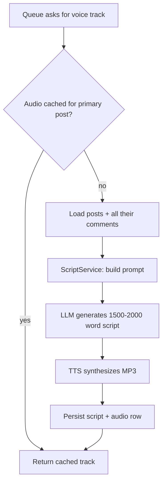

# Radio — Script Generation & Voice Tracks

Turns scraped posts + comments into a call-in talk-radio segment: an LLM writes the script, TTS voices it, and the result is cached for the channel queue.

## Public API

No HTTP routes. Consumed internally by `QueueGeneratorService` (channel slice).

| Service | Contract |
|---|---|
| `RadioService.getSegmentVoiceTrack(postIds)` | Given a topic's posts, returns a ready-to-play voice track `{ filePath, durationSeconds }` — from cache if it exists. |

## Behaviour — generation pipeline

- **Cache key = the primary post** (first post of the cluster). A topic built from the same primary post never regenerates.
- Generation is **asynchronous from the queue's perspective**: the queue marks the segment `generating`, then flips it to `ready` (or `failed`) when done — see `src/channel/README.md`.

## Script rules (what the LLM is told)

- **Format**: 4 co-hosts — **Dave, Sarah, Mike, Jenny** — plus a guest **Caller** (based on the post author). Every line is `[Speaker Name]: text`.
- **Structure — 4 acts**: intro/welcome → caller explains their situation → co-hosts debate using the commenters' stances *as their own arguments* (never quoted) → outro.
- **Length**: 1,500–2,000 words ≈ 10–15 minutes of airtime.
- **No Reddit jargon** ("OP", "upvote", "subreddit") and no markdown — it's spoken dialogue.

## Comment selection rules (what the LLM sees)

- Top-level comments sorted by **score, descending**; whole reply chains are kept together (a reply never appears without its parent thread).
- **Floor**: keep adding chains until ~2,500 words (post title + body included) — this is the same budget the feed slice enforces at scrape time.
- **Ceiling**: hard stop at 3,500 words — never exceed.
- Nested replies within a chain are rendered score-sorted, and caller replies are labelled as such.

## TTS

- Google Cloud TTS (`texttospeech.googleapis.com`), voice `en-US-Studio-O`, MP3 output.
- Duration is computed from the file: 128kbps CBR MP3 = 16,000 bytes/sec, so `duration = bytes / 16000`. **This drives the entire radio clock** — segment durations, chunking, and playhead math all assume it.
